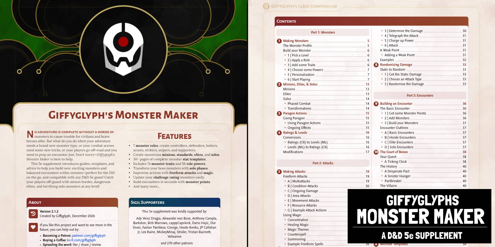
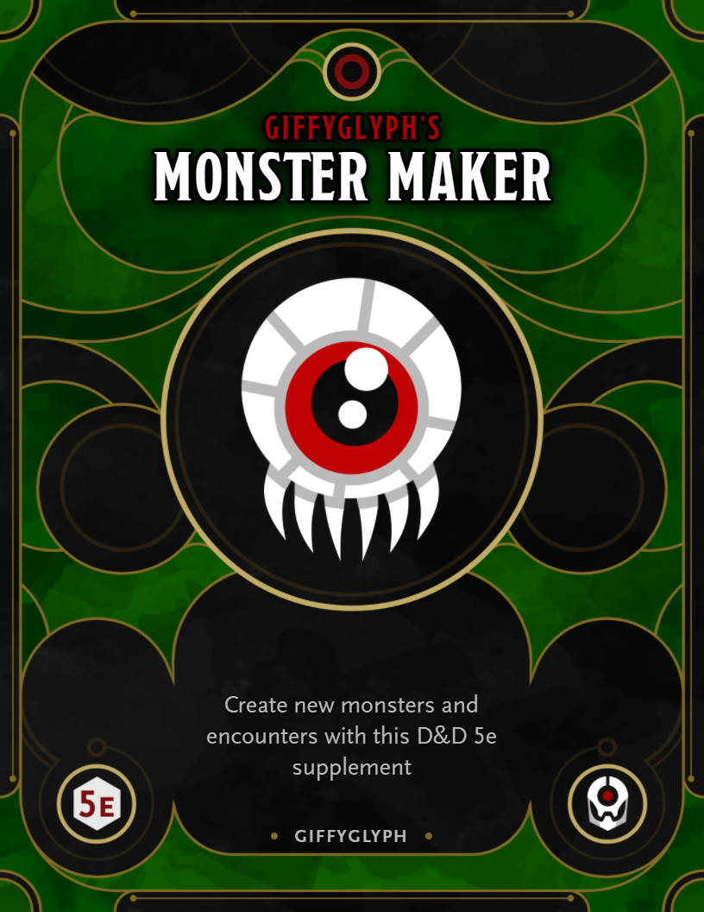
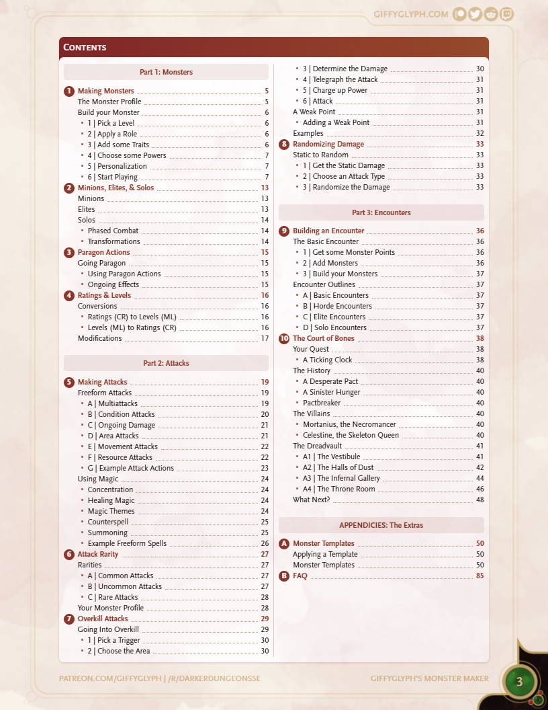

# Giffyglyph's Monster Maker

Do you want to build fun, balanced monsters in D&D 5e? Is encounter design a huge timesink for you? Need some varied combat options that will get you running encounters in seconds? Then try **Giffyglyph's Monster Maker**: rules, advice, and templates to help you build new monsters and prepare combat encounters with ease!

* [Read the Latest PDF (v2.1.2)](https://github.com/giffyglyph/giffyglyphs-monster-maker/raw/master/releases/giffyglyphs_monster_maker_v2_1_2.pdf)
* [Read the Changelog](https://github.com/giffyglyph/giffyglyphs-monster-maker/blob/master/docs/CHANGELOG.md) 

## Features

* Swap out Challenge Ratings (CR) for easy-to-track **Monster Levels (ML)**.
* Build monsters of any level with simplified **Monster Stats**.
* Give your monsters some identity in combat with **Monster Roles**.
* Add simple **Traits & Powers** to create interesting variety in your combat.
* Use **Freeform Attacks & Magic** to make your encounters dynamic and easy-to-run.
* Create special attacks easily with **Attack Rarities**.
* Give your big monsters wild, over-the-top **Overkill Attacks**.
* Build encounters in seconds with **Monster Points**.
* Explore an example adventure, **The Court of Bones**.

| Cover                                                    | Chapters (v2.1.2)                                           |
| -------------------------------------------------------- | ----------------------------------------------------------- |
|  |  |

## Roadmap

To see what's being worked on right now—and what may be planned for the future—check out the **[projects board](https://github.com/giffyglyph/giffyglyphs-monster-maker/projects)**.

## Bugs and Feature Suggestions

If you notice a bug or have a feature suggestion, visit the **[issue board](https://github.com/giffyglyph/giffyglyphs-monster-maker/issues)** and open a ticket. Please make sure to be as thorough as possible in your report and attach screenshots where appropriate, as low-effort tickets may be closed out-of-hand.

## Support

If you'd like to see more from this project in future, please consider [becoming a patron](https://www.patreon.com/giffyglyph). You can also find more of my work at:

* [giffyglyph.com](https://giffyglyph.com)
* [twitter](https://twitter.com/giffyglyph)
* [twitch.tv/giffyglyph](https://twitch.tv/giffyglyph)

## Licensing

This work is licensed under a [Creative Commons Attribution-NonCommercial-NoDerivatives 4.0 International License](http://creativecommons.org/licenses/by-nc-nd/4.0/).